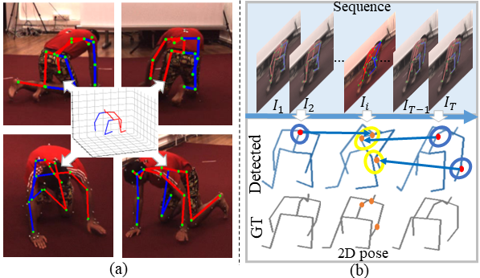

# ESMformer: Error-aware Self-supervised Transformer for Multi-view 3D Human Pose Estimation

<p align="center"></p>

## News 🚩

[2024/07/09] We have released the training and testing code as well as part of the training weights!

[2023/04/18] The codes of our model are released!

## TODO 🚩

- We will provide more training weights soon.

## Installation

- Create a conda environment: ``conda create -n esmformer python=3.7``
- Download cudatoolkit=11.0 from [here](https://developer.nvidia.com/cuda-11.0-download-archive) and install
- ``pip3 install torch==1.7.1+cu110 torchvision==0.8.2+cu110 -f https://download.pytorch.org/whl/torch_stable.html``
- ``pip3 install -r requirements.txt``

## Dataset Setup

Please download the dataset from [Human3.6M](http://vision.imar.ro/human3.6m/) website and refer
to [VideoPose3D](https://github.com/facebookresearch/VideoPose3D) to set up the Human3.6M dataset ('./dataset'
directory).
Or you can get the processed data by running the following code.

```bash
sh get_datasets.sh
```

The directory of the processed dataset should look like this:

```bash
${POSE_ROOT}/
|-- dataset
|   |-- data_3d_h36m.npz
|   |-- data_2d_h36m_gt.npz
|   |-- data_2d_h36m_cpn_ft_h36m_dbb.npz
```

## Test the Model

```bash
python main.py --test --previous_dir ./checkpoint/full_cpn.pth
```

## Train the Model

### Supervised

```bash
python main.py --batch_size 1024 --frames 27 --lr 0.0005 --nepoch 50
```

### Self-Supervised

```bash
python main.py --batch_size 1024 --nepoch 50 --adaptive_loss 1 --self_supervised 1 --reproj_loss 1 --tri_loss 1 --loss_w 0.8
```

## Model Performance

### Human3.6M

| Methods | MPJPE | P-MPJPE |
| :------: | :---: | :-----: |
| Full_CPN | 27.4 |  22.1  |
| Full_GT | 17.6 |  11.8  |
| self_CPN | 34.5 |  26.7  |
| self_GT | 20.9 |  12.6  |

### MPI-INF-3DHP

|  Methods  | MPJPE | P-MPJPE |
| :--------: | :---: | :-----: |
| Full_3DHP | 21.8 |  16.7  |
| Full_H36M+ | 18.6 |  14.8  |
| self_3DHP | 58.6 |  40.3  |
| self_H36M+ | 46.2 |  32.5  |

### Ski-Pose

|  Methods  | MPJPE | P-MPJPE |
| :--------: | :---: | :-----: |
|  Full_Ski  | 61.2 |  45.8  |
| Full_H36M+ | 47.9 |  33.6  |

## Acknowledgement

Our code is extended from the following repositories. We thank the authors for releasing the codes.

- [Pose_3D](https://github.com/vru2020/Pose_3D/)
- [VideoPose3D](https://github.com/facebookresearch/VideoPose3D)
