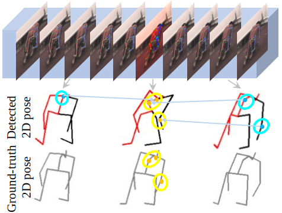

# ESMformer: Error-aware Self-supervised Transformer for Multi-view 3D Human Pose Estimation

<p align="center"></p>

## Installation

- Create a conda environment: ```conda create -n esmformer python=3.7```
- Download cudatoolkit=11.0 from [here](https://developer.nvidia.com/cuda-11.0-download-archive) and install 
- ```pip3 install torch==1.7.1+cu110 torchvision==0.8.2+cu110 -f https://download.pytorch.org/whl/torch_stable.html```
- ```pip3 install -r requirements.txt```

## Dataset Setup

Please download the dataset from [Human3.6M](http://vision.imar.ro/human3.6m/) website and refer to [VideoPose3D](https://github.com/facebookresearch/VideoPose3D) to set up the Human3.6M dataset ('./dataset' directory). 
Or you can download the processed data from [here](https://drive.google.com/drive/folders/1F_qbuZTwLJGUSib1oBUTYfOrLB6-MKrM?usp=sharing). 

```bash
${POSE_ROOT}/
|-- dataset
|   |-- data_3d_h36m.npz
|   |-- data_2d_h36m_gt.npz
|   |-- data_2d_h36m_cpn_ft_h36m_dbb.npz
```

## Download Pretrained Model

The pretrained model can be found in [here](https://drive.google.com/drive/folders/1pX5mK1O9x0OKbK0ZJdMuDPQqvJQJgr18?usp=sharing), please download it and put it in the './checkpoint/pretrained' directory. 

## Test the Model

To test on a supervised pretrained model on Human3.6M:

```bash
python main.py --test --previous_dir './checkpoint/pretrained/supervised_model.pth'
```
To test on a self supervised with Error-aware pretrained model on Human3.6M:

```bash
python main.py --self_supervised 1 --test --previous_dir './checkpoint/pretrained/self_supervised_with_Error_aware_model.pth'
```

## Train the Model
To train a model on Human3.6M with supervised:

```bash
python main.py --batch_size 256 --nepoch 25
```

To train a model on Human3.6M with error-aware self supervised:

```bash
python main.py --batch_size 256 --nepoch 25 --adaptive_loss 1 --self_supervised 1 --reproj_loss 1 --tri_loss 1 --loss_w 0.8
```

## Acknowledgement

Our code is extended from the following repositories. We thank the authors for releasing the codes. 

- [Pose_3D](https://github.com/vru2020/Pose_3D/)
- [VideoPose3D](https://github.com/facebookresearch/VideoPose3D)
